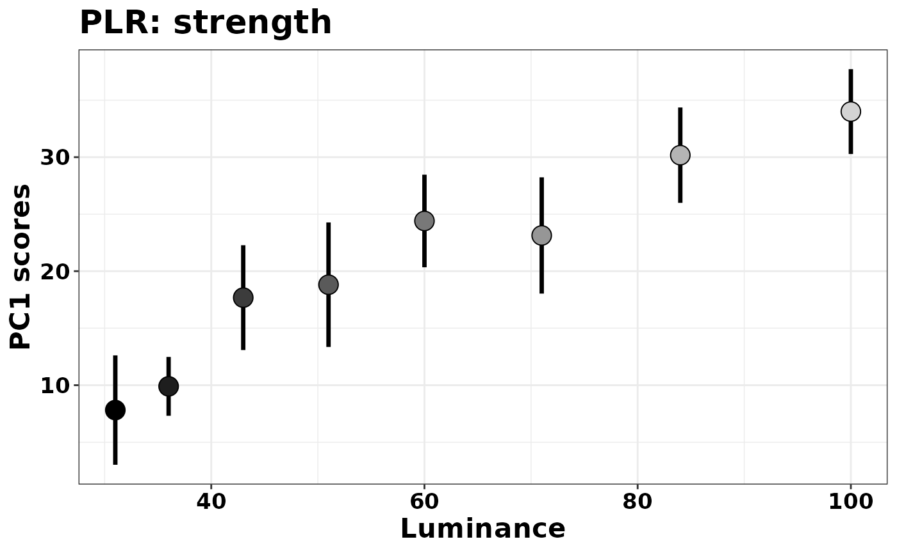
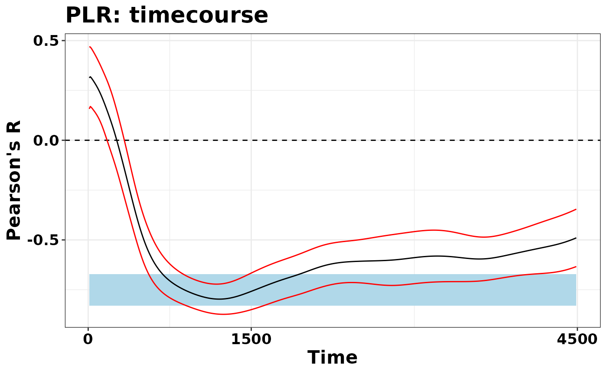
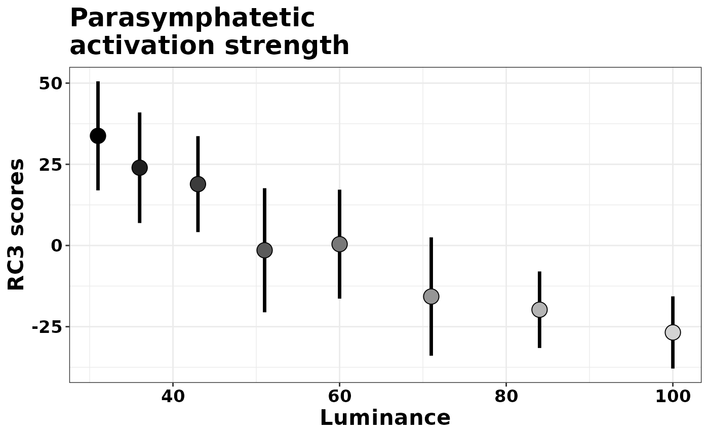
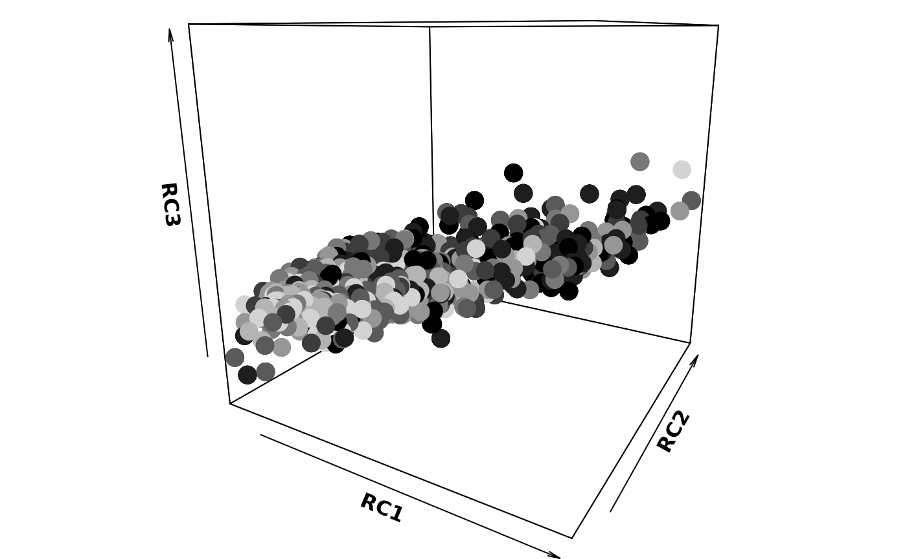

# Pupilla::Assessing_Pupillary_Manifold

### Introduction

`Pupilla` gathers several functions that are designed to facilitate the
analysis of pupillometry experiments as commonly performed in cognitive
neuroscience, e.g. event-related designs, although its use could be much
more general.

The typical analysis pipeline would, coarsely, include the following
steps:

1.  **Read the data.** This part can vary a lot depending on the
    eyetracker used, the individual OS, local paths, how the experiment
    was coded, etc. `Pupilla` does provide utility functions to read
    from common eyetrackers (e.g., TOBII, EyeLink) but clearly this
    passage will need to be tailored to your files.

2.  **Prepare the data.** As above, this part may need to be tailored to
    your specific needs; however, several steps are very common across
    pipelines, and will be presented in this vignette.

3.  **Preprocessing.** Pupillometry needs robust preprocessing of the
    raw data, in order to reduce noise and artifacts (such as those due
    to blinks). Once the data is properly prepared, this aspect can be
    translated across several different scenarios. Of course,
    flexibility and adapting to your own data is warmly advised.

4.  **Statistical modelling**. `Pupilla` offers two approaches: 1)
    crossvalidated LMEMs as in [Mathôt & Vilotijević,
    2022](https://link.springer.com/article/10.3758/s13428-022-01957-7));
    and 2) an original approach through feature/dimensionality
    reduction. This vignette covers and illustrates the second option.
    In particular, we will show what we mean with “assessing the
    pupillary manifold”, as outlined in the accompanying paper.

For this example we use data from [Blini, Arrighi, and Anobile,
2024](https://www.biorxiv.org/content/10.1101/2024.05.23.595554v3). Data
can be retrieved in full from the associated [OSF
repository](https://osf.io/dkpcs). If you install `Pupilla` with the
data included, however, you will actually find the complete preprocessed
data from Exp 1 (the “PLR” task) included in the package, so that it
will be extremely easy to lead them in R (shown below).

In this task we asked 20 healthy, young participants to passively watch
a matrix of numbers change color/luminance level. Thus, the data
highlight the well known **Pupillary Light Response (PLR)**. The aim of
this vignette is to present how temporal PCA and rotated temporal PCA
can be implemented with `Pupilla`.

### Read the data

The library `Pupilla` must be installed first, and only once, through
`devtools`:

``` r
#install.packages("devtools")
devtools::install_github("EBlini/Pupilla")
```

Dependencies will be installed automatically. We will then need to load
the following packages:

``` r
library("Pupilla")
library("dplyr") 
```

    ## 
    ## Attaching package: 'dplyr'

    ## The following objects are masked from 'package:stats':
    ## 
    ##     filter, lag

    ## The following objects are masked from 'package:base':
    ## 
    ##     intersect, setdiff, setequal, union

``` r
library("ggplot2") 
options(dplyr.summarise.inform = FALSE)
```

Reading the data is straightforward in that the data come with the
package:

``` r
data(plr)
```

That’s it! Note that the recordings have been preprocessed already,
including baseline subtraction. We can plot the results:

``` r
plr$Luminance= as.factor(plr$Luminance)

colfunc <- colorRampPalette(c("black", "light gray"))
plr$Color= colfunc(8)[plr$Luminance]

plr %>%
  group_by(Subject, Luminance, Time) %>%
  summarise(Pupil= mean(Pupil), Color= Color[1]) %>%
  #between
  group_by(Luminance, Time) %>%
  summarise(SEM= sd(Pupil)/sqrt(n()),
            SEM= 1.96*SEM,
            Pupil= mean(Pupil),
            Color= Color[1]) %>%
  ggplot(aes(x= Time, y= Pupil)) +
  geom_vline(xintercept = c(0), linewidth= 1,
             color= "gray", linetype= "dashed") +
  geom_hline(yintercept = 0, linewidth= 1,
             color= "gray", linetype= "dashed") +
  geom_line(aes(color= Luminance),
            linewidth= 1.2, show.legend = T) +
  scale_color_manual(values = colfunc(8)) +
  geom_ribbon(aes(ymin= Pupil-SEM,
                 ymax= Pupil+SEM, 
                 fill= Luminance),
             alpha= 0.2) +
  scale_fill_manual(values = colfunc(8)) +
  theme_bw() +
  theme(text= element_text(size= 16,
                           face="bold",
                           color= "black")) +
  xlab("Time (ms)") +
  ylab("Pupil size change (z scores)") +
  ggtitle("PLR: changes in pupil size") + 
  scale_x_continuous(breaks=c(0, 1500, 4500)) 
```


As you can see, the brighter the luminance, the stronger the pupil
constriction, with peak values between 1-1.5 s, followed by pupil
escape.

## Dimensionality reduction

## temporal PCA

Temporal PCA attempts to summarise the data in fewer dimensions by at
the same time maximizing the amount of information retained. The scores
that can be obtained in this way are: 1. very handy to analyse 2. very
interpretable (but see below and the paper) 3. mindful of the factor
“time” (that is weighted in) 4. fully data-driven, hence less arbitrary.

Temporal PCA in `Pupilla` is implemented as a wrapper around
[`stats::prcomp()`](https://rdrr.io/r/stats/prcomp.html), and is very
straightforward (once data have been preprocessed).

``` r
#this is not always necessary 
#but do make sure that "Time" is properly ordered
plr= plr %>%
  arrange(Subject, trial, Time)  

#you must include only timepoints with non-zero variance
data= plr[plr$Time> 0,]

#for clarity, here's the variables needed
dv= "Pupil"
time = "Time" 
id = "Subject"
trial =  "trial"
Ncomp = 3 #not very relevant for PCA
add= c("Luminance")

#Temporal PCA is actually only one function!
plr_pca= reduce_PCA(data, 
                    dv= dv,
                    time = time, 
                    id = id,
                    trial =  trial,
                    Ncomp= Ncomp,
                    add= add)
```

    ## Warning in reduce_PCA(data, dv = dv, time = time, id = id, trial = trial, : NAs in the data will be discarded:
    ##             check the data!

There is an overly-sensitive reminder that PCA only works if you **do
not** have missing values for any timepoint. If any value within one
recording is missing, the respective trial will not be considered for
PCA. In other words: you cannot have trials of different length or
sampling rate or without imputation/interpolation of missing values, and
all the time points must be the same.

Apart for this, PCA with `Pupilla` ends here! Let’s look at the object
created this way:

``` r
names(plr_pca)
```

    ## [1] "rs_mat"     "summaryPCA" "Loadings"   "Scores"     "PCA"       
    ## [6] "scaling"

The object is a list with the following entries:

1.  **“rs_mat”** is the matrix used for PCA, for your reference. You
    probably will not need this, but it’s always good to check whether
    the matrix has the dimensions that you expect.

``` r
dim(plr_pca$rs_mat)
```

    ## [1] 869 449

``` r
#rows are all trials from all participants
length(
  unique(
    interaction(plr$Subject, plr$trial)))
```

    ## [1] 869

``` r
#colums are the timepoints considered
length(
  unique(
    plr$Time[plr$Time>0]))
```

    ## [1] 449

In the future this message may become more informative / reassuring.

2.  **“summaryPCA”** is the summary returned by
    [`prcomp()`](https://rdrr.io/r/stats/prcomp.html). It has all the
    components (the rows in your data) together with the respective
    eigenvalues and share of explained variance.

3.  **“Loadings”** are the eigenvectors for PCA and the Loadings
    (proper) for rotated solutions. This may perhaps be changed in the
    future, e.g. to “weights” for enhanced compatibility.

4.  **“Scores”** are, yes, the Scores, that is the “strength” of one
    component in the low dimensional space.

5.  **“PCA”** is the object returned by
    [`prcomp()`](https://rdrr.io/r/stats/prcomp.html). You may not need
    it directly though it is useful for prediction of unobserved data,
    for example (see, e.g., the function
    [`Pupilla::predict_feature()`](../reference/predict_feature.md)).

6.  **“scaling”** is information about data scaling, if relevant. This
    is mostly useful if you change the default settings - which do not
    normalize or center the data because they assume you already did
    baseline subtraction at very least - but then you want to predict
    new, untrained data (which then should be normalized according to
    the original values used in the model, see
    [`Pupilla::predict_feature()`](../reference/predict_feature.md)).

In a typical pipeline, we can start by assessing the relative
contribution (to the explained variance) of each component.

``` r
plr_pca$summaryPCA[,1:Ncomp]
```

    ##                             PC1      PC2      PC3
    ## Standard deviation     30.88680 11.53209 7.752494
    ## Proportion of Variance  0.78546  0.10950 0.049480
    ## Cumulative Proportion   0.78546  0.89496 0.944440

The first one can account for a very substantial share of the
variability, that is almost 80%. There are several helper functions to
depict the eigenvectors. For the depiction of single components you can
use:

``` r
plot_loadings("PC1", plr_pca)
```


Else, you can plot all components together with
[`Pupilla::plot_fingerprints()`](../reference/plot_fingerprints.md). I
originally used the term “fingerprints” assuming that certain changes in
pupil size are the signature of distinct physiological processes, though
now I lean toward thinking this is only applicable to rotated solutions
(see below); for those, however, I will reserve the term “pupillary
manifold”, whereas “fingerprints” can perhaps be more general and
include all sorts of latent constructs, regardless of their origin. In
fact, this function will work for temporal PCA, rotated PCA, and
Independent Components Analysis (ICA, not coped with here, though you do
have functions for that). The catch: for now this function only work
when `Ncomp== 3`; later on, it will be clearer why.

``` r
plot_fingerprints(plr_pca)
```


The function has options to reorder the variables or to flip their sign
(note that the sign of the eigenvectors is perfectly arbitrary in PCA):

``` r
plot_fingerprints(plr_pca, 
                  order = "peak", 
                  flip = c(1, -1, 1))
```

    ## Warning in plot_fingerprints(plr_pca, order = "peak", flip = c(1, -1, 1)):
    ## Warning: fingerprint names have been reordered following the explained
    ## variance!


Then, you probably want to assess the scores. Scores are saved in the
dataframe returned by the `reduce_feature()` object. If you have
additional experimental variables to assess, you can add this piece of
information when performing PCA through the `add` parameter. This way,
the dataframe will have all the relevant information, and you can
proceed to modelling or plotting directly with the dataframe provided.

``` r
pca_scores= plr_pca$Scores %>%
  mutate(Luminance= as.numeric(Luminance)) %>% 
  group_by(id, Luminance) %>%
  summarise(PC1= mean(PC1)) %>%
  group_by(Luminance) %>%
  summarise(SEM= sd(PC1)/sqrt(n()),
            SEM= 1.96*SEM,
            PC1= mean(PC1))

ggplot(pca_scores, aes(x = Luminance, y = PC1)) +
  geom_segment(aes(
    y = PC1 - SEM,
    yend = PC1 + SEM,
    xend = Luminance
  ), linewidth = 1.2) +
  geom_point(
    aes(fill = as.factor(Luminance)),
    shape = 21,
    size = 5,
    show.legend = F
  ) +
  scale_fill_manual(values = colfunc(8)) +
  xlab("Luminance") +
  ylab("PC1 scores") +
  theme_bw() +
  theme(
    text = ggplot2::element_text(
      size = 16,
      face = "bold",
      colour = "black"
    ),
    axis.text = element_text(colour = "black")
  ) +
  ggtitle("PLR: strength")
```



Here we can see that the first component is a latent dimension along
which the PLR happens with distinct strength, and different luminance
conditions are well separable along this dimension. That the scores do
reflect the “strength of the PLR” is also suggested by the shape of the
eigenvector of PC1 seen above, which reflects our principled knowledge
of what the PLR should look like. Below we additionally map the strength
of the correlation between objective luminance levels and the scores of
this component.

``` r
plr$Luminance=as.numeric(as.character(plr$Luminance))

pca_cor= plr_pca$Scores %>%
  mutate(Luminance= as.numeric(as.character(Luminance))) %>% 
  group_by(id, Luminance) %>%
  summarise(PC1= mean(PC1)) %>%
  group_by(id) %>%
  summarise(R= cor(PC1, Luminance))

M= mean(pca_cor$R)
SEM= sd(pca_cor$R)/sqrt(20)

ymax= M + 1.96*SEM
ymin= M - 1.96*SEM

plr_mean= plr %>% filter(Time > 0) %>% 
  group_by(Subject, Time, Luminance) %>% 
  summarise(Pupil= mean(Pupil)) %>% 
  group_by(Subject, Time) %>% 
  summarise(R= cor(Pupil, Luminance)) %>% 
  group_by(Time) %>%
  summarise(M= mean(R), SEM= sd(R)/sqrt(20))

ggplot(plr_mean, aes(x= Time, y= M)) +
  geom_hline(yintercept = 0, linetype= "dashed") +
  geom_rect(aes(xmin= 10, xmax= 4490, 
                ymin= - ymin, 
                ymax= - ymax), 
            fill= "light blue", 
            alpha= 0.3) +
  geom_line() +
  geom_line(aes(y= M - 1.96*SEM), color= "red")+
  geom_line(aes(y= M + 1.96*SEM), color= "red") +
  theme_bw() +
  ylab("Pearson's R") + 
  scale_x_continuous(breaks=c(0, 1500, 4500)) +
    theme(text= ggplot2::element_text(size= 16,
                                             face="bold",
                                             colour= "black"),
                 axis.text= element_text(colour= "black")) +
  ggtitle("PLR: timecourse")
```



To conclude, temporal PCA represents a very handy approach, capable to
return few, very manageable values that are mindful of the temporal
aspect. On the other hand, as we discuss in the paper, the approach
should be used whenever we are fully confident that the process at hand
only involves one (or one major) process that we intend to isolate. For
example, when we add some sort of **Working Memory Load (WML)** to the
equation, that is different levels of cognitive load and hence of the
associated psychosensory dilation, the eigenvector of the first
component still captures the major axis of variability, i.e. a mixture
of the PLR and WML effects, without dissociating the two.

As we discuss in the paper, at that point we may want to use approaches
that are not only mindful of the temporal aspects, but also of the
underlying physiology. This, we refer to as “assessing the pupillary
manifold”.

## Rotated PCA

rotated PCA is implemented in the package as wrappers around
[`psych::principal()`](https://rdrr.io/pkg/psych/man/principal.html).
Please note that the function, even in absence of rotations, produces
slightly different results from
[`stats::prcomp()`](https://rdrr.io/r/stats/prcomp.html) in light of
several differences in parametrization and analytical approach. Please
refer to the excellent `psych` package documentation for the differences
between
[`psych::principal()`](https://rdrr.io/pkg/psych/man/principal.html) and
[`psych::fa()`](https://rdrr.io/pkg/psych/man/fa.html).

However, the implementation of rotated PCA is extremely similar to that
of regular PCA. The only extra bit of information required is the
rotation type - but the default is “promax”, and should do.

``` r
#again, just in case
plr= plr %>%
  arrange(Subject, trial, Time)  

#you must include only timepoints with non-zero variance
data= plr[plr$Time> 0,]

#for clarity, here's the variables needed
dv= "Pupil"
time = "Time" 
id = "Subject"
trial =  "trial"
Ncomp = 3 #very relevant for rPCA
add= c("Luminance")
rotate= "promax" #new!

#Temporal PCA is actually only one function!
plr_rpca = reduce_rPCA(
  data,
  dv = dv,
  time = time,
  id = id,
  trial =  trial,
  Ncomp = Ncomp,
  add = add,
  rotate = rotate
)
```

    ## Warning in reduce_rPCA(data, dv = dv, time = time, id = id, trial = trial, : NAs in the data will be discarded:
    ##             check the data!

    ## Warning in cor.smooth(r): Matrix was not positive definite, smoothing was done

    ## The determinant of the smoothed correlation was zero.
    ## This means the objective function is not defined.
    ## Chi square is based upon observed residuals.

    ## The determinant of the smoothed correlation was zero.
    ## This means the objective function is not defined for the null model either.
    ## The Chi square is thus based upon observed correlations.

    ## Warning in psych::principal(rs_mat, nfactors = Ncomp, rotate = rotate): The
    ## matrix is not positive semi-definite, scores found from Structure loadings

You will inevitably see many warnings from `psych`. My reading is that
these warnings are harmless because only lamenting the high
dimensionality of the data, and the inability to tell whether a `Ncomp`
solution would be appropriate given the data. Then, the only differences
in the returned object are:

``` r
names(plr_rpca)
```

    ## [1] "rs_mat"      "summaryPCA"  "summaryRPCA" "Loadings"    "Scores"     
    ## [6] "rPCA"        "scaling"

1.  The model returned is not, of course, based on
    [`prcomp()`](https://rdrr.io/r/stats/prcomp.html) but on
    `principal()`

2.  On top of the PCA summary - which is still based on prcomp - you can
    find the **summaryRPCA**, reporting the same information but for the
    rotated solution.

``` r
plr_rpca$summaryRPCA
```

    ##                               RC1         RC2        RC3
    ## SS loadings           176.4576950 151.1138267 59.6308080
    ## Proportion Var          0.3930015   0.3365564  0.1328080
    ## Cumulative Var          0.3930015   0.7295580  0.8623660
    ## Proportion Explained    0.4557248   0.3902710  0.1540043
    ## Cumulative Proportion   0.4557248   0.8459957  1.0000000

Notice that the overall explained variance is 86%, instead of 95% by
prcomp. This would also be the case with `rotate= "none"`, and has to do
with the internal parameters of `principal()`. You can also see that the
single components have also changed their share of explained variance,
this time in light of the rotation itself. They account for a more even
share of variance, i.e. 39% for rPC1 and 34% for rPC2.

You can use the same set of wrapper functions as above:

``` r
plot_fingerprints(plr_rpca)
```


And you can assess the scores as well:

``` r
rpca_scores= plr_rpca$Scores %>%
  mutate(Luminance= as.numeric(Luminance)) %>% 
  group_by(id, Luminance) %>%
  summarise(RC3= mean(RC3)) %>%
  group_by(Luminance) %>%
  summarise(SEM= sd(RC3)/sqrt(n()),
            SEM= 1.96*SEM,
            RC3= mean(RC3))

ggplot(rpca_scores, 
       aes(x = Luminance, y = RC3)) +
  geom_segment(aes(
    y = RC3 - SEM,
    yend = RC3 + SEM,
    xend = Luminance
  ), linewidth = 1.2) +
  geom_point(
    aes(fill = as.factor(Luminance)),
    shape = 21,
    size = 5,
    show.legend = F
  ) +
  scale_fill_manual(values = colfunc(8)) +
  xlab("Luminance") +
  ylab("RC3 scores") +
  theme_bw() +
  theme(
    text = ggplot2::element_text(
      size = 16,
      face = "bold",
      colour = "black"
    ),
    axis.text = element_text(colour = "black")
  ) +
  ggtitle("Parasymphatetic\nactivation strength")
```



What changes is the likely meaning of the scores.

## The Pupillary Manifold

As we discuss more thoroughly in the paper, the rotated solution returns
a set of loadings that is extremely constant across different tasks. In
this sense it is unlikely to reflect something idiosyncratic to the
data. On the contrary, loadings are more likely to reflect hard
constraints of the underlying physiology or the signal itself. The
suggestion is made that the three components recovered in this way
reflect physiologically relevant processes:

1.  **RC1**: symphatetic activation
2.  **RC2**: parasymphatetic inhibition
3.  **RC3**: parasymphatetic activation

The relative scores define where the pupil traces lie (their
coordinates) on a low-dimensional space reflecting the overall balance
of the autonomic nervous system. Thus, on top of being handy to analyze,
mindful of temporal aspects, completely data-driven, and so on, these
values are also physiologically meaningful.

The toolbox comes with wrapper functions for 3D plots through `plot3D`,
which is not installed by default with the package - so `plot3D` should
be installed manually.

``` r
plr_rpca$Scores$Luminance= as.factor(plr_rpca$Scores$Luminance)

plr_rpca$Scores$Luminance = factor(plr_rpca$Scores$Luminance,
                                   levels = c("31", "36", "43", "51", "60", "71", "84", "100"))

plot_manifold(plr_rpca$Scores,
              colvar = "Luminance", 
              theta = 30, phi= 15)
```

    ## Warning: no DISPLAY variable so Tk is not available



Finally, `gifski` (not installed automatically) provides utilities to
create GIFs from several different images. The function
[`animate_manifold()`](../reference/animate_manifold.md) does precisely
that: it creates a folder populated with many
[`plot_manifold()`](../reference/plot_manifold.md) images taken from
different views, an saves a gif image in the current path.

## Appendix

Packages’ versions:

``` r
sessionInfo()
```

    ## R version 4.5.2 (2025-10-31)
    ## Platform: x86_64-pc-linux-gnu
    ## Running under: Ubuntu 24.04.3 LTS
    ## 
    ## Matrix products: default
    ## BLAS:   /usr/lib/x86_64-linux-gnu/openblas-pthread/libblas.so.3 
    ## LAPACK: /usr/lib/x86_64-linux-gnu/openblas-pthread/libopenblasp-r0.3.26.so;  LAPACK version 3.12.0
    ## 
    ## locale:
    ##  [1] LC_CTYPE=C.UTF-8       LC_NUMERIC=C           LC_TIME=C.UTF-8       
    ##  [4] LC_COLLATE=C.UTF-8     LC_MONETARY=C.UTF-8    LC_MESSAGES=C.UTF-8   
    ##  [7] LC_PAPER=C.UTF-8       LC_NAME=C              LC_ADDRESS=C          
    ## [10] LC_TELEPHONE=C         LC_MEASUREMENT=C.UTF-8 LC_IDENTIFICATION=C   
    ## 
    ## time zone: UTC
    ## tzcode source: system (glibc)
    ## 
    ## attached base packages:
    ## [1] stats     graphics  grDevices utils     datasets  methods   base     
    ## 
    ## other attached packages:
    ## [1] ggplot2_4.0.1    dplyr_1.1.4      Pupilla_0.1.2.01
    ## 
    ## loaded via a namespace (and not attached):
    ##  [1] gtable_0.3.6       jsonlite_2.0.0     compiler_4.5.2     plot3D_1.4.2      
    ##  [5] psych_2.5.6        tidyselect_1.2.1   parallel_4.5.2     jquerylib_0.1.4   
    ##  [9] systemfonts_1.3.1  scales_1.4.0       textshaping_1.0.4  yaml_2.3.10       
    ## [13] fastmap_1.2.0      lattice_0.22-7     R6_2.6.1           tcltk_4.5.2       
    ## [17] labeling_0.4.3     generics_0.1.4     knitr_1.50         misc3d_0.9-1      
    ## [21] tibble_3.3.0       desc_1.4.3         bslib_0.9.0        pillar_1.11.1     
    ## [25] RColorBrewer_1.1-3 rlang_1.1.6        cachem_1.1.0       xfun_0.54         
    ## [29] fs_1.6.6           sass_0.4.10        S7_0.2.1           cli_3.6.5         
    ## [33] pkgdown_2.2.0      withr_3.0.2        magrittr_2.0.4     digest_0.6.39     
    ## [37] grid_4.5.2         nlme_3.1-168       lifecycle_1.0.4    vctrs_0.6.5       
    ## [41] mnormt_2.1.1       evaluate_1.0.5     glue_1.8.0         farver_2.1.2      
    ## [45] ragg_1.5.0         rmarkdown_2.30     tools_4.5.2        pkgconfig_2.0.3   
    ## [49] htmltools_0.5.8.1
