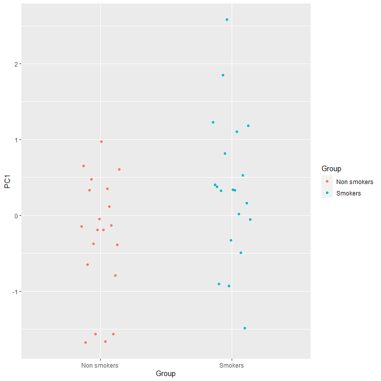
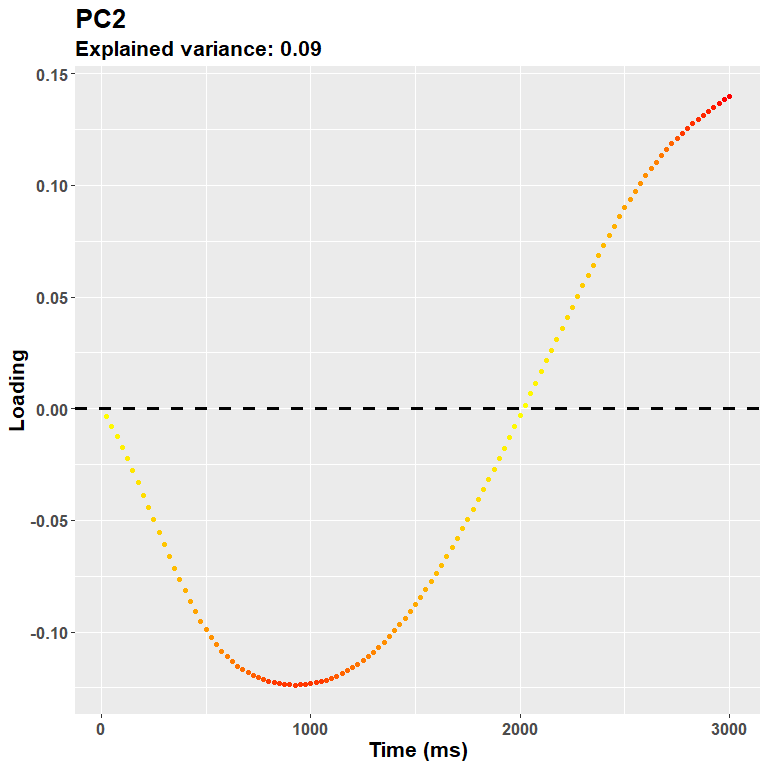
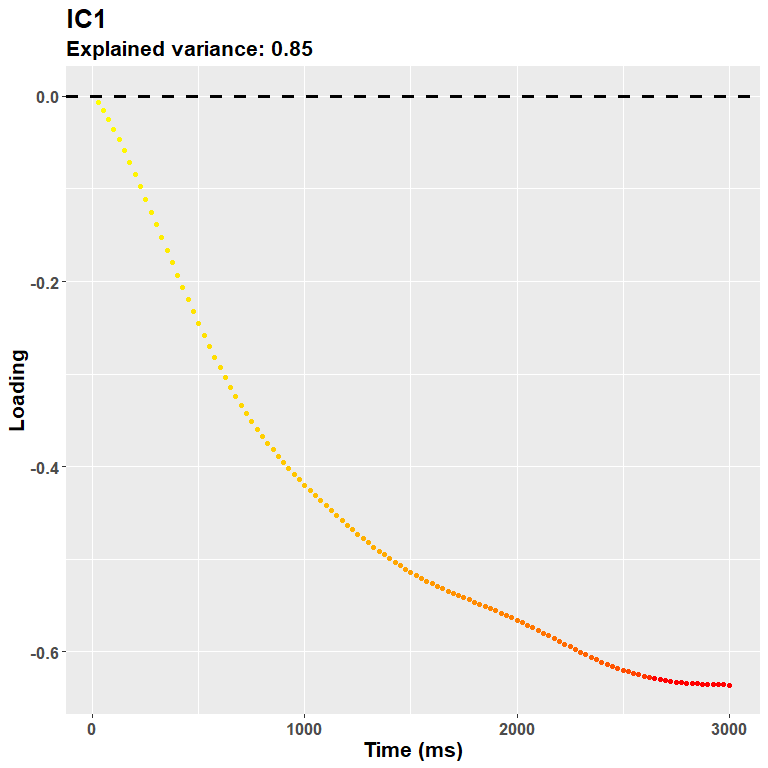
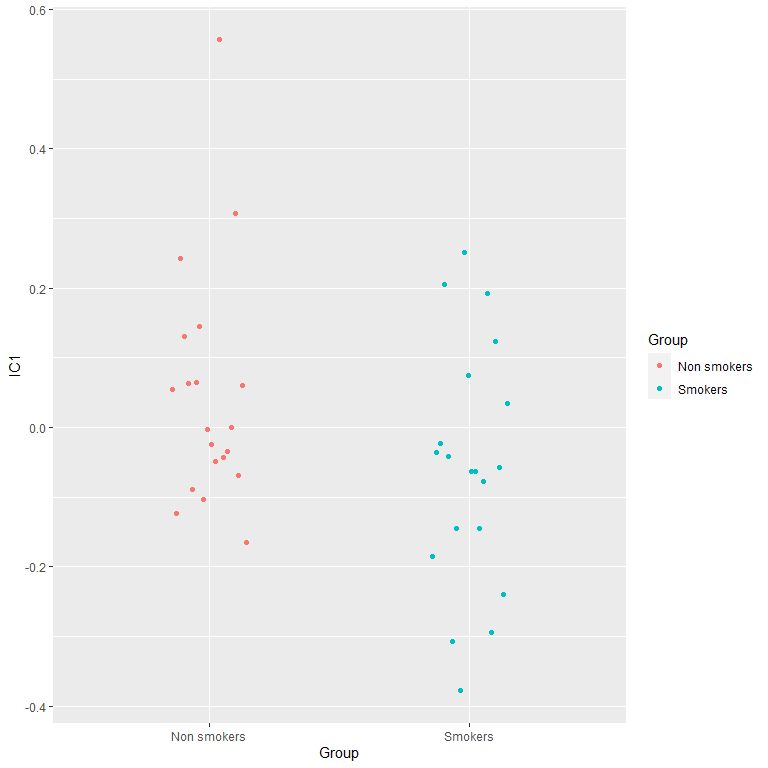

# Pupilla::TOBII::Reduce_Features

## Introduction

`Pupilla` gathers several functions that are designed to facilitate the
analysis of pupillometry experiments as commonly performed in cognitive
neuroscience, e.g. event-related designs, although its use could be much
more general.

The typical analysis pipeline would, coarsely, include the following
steps:

1.  **Read the data.** This part can vary a lot depending on the
    eyetracker used, the individual OS, local paths, how the experiment
    was coded, etc. `Pupilla` does provide utility functions to read
    from common eyetrackers (e.g., TOBII, EyeLink) but clearly this
    passage will need to be tailored to your files.

2.  **Prepare the data.** As above, this part may need to be tailored to
    your specific needs; however, several steps are very common across
    pipelines, and will be presented in this vignette.

3.  **Preprocessing.** Pupillometry needs robust preprocessing of the
    raw data, in order to reduce noise and artifacts (such as those due
    to blinks). Once the data is properly prepared, this aspect can be
    translated across several different scenarios. Of course,
    flexibility and adapting to your own data is warmly advised.

4.  **Statistical modelling**. `Pupilla` offers two approaches: 1)
    crossvalidated LMEMs as in [Mathôt & Vilotijević,
    2022](https://link.springer.com/article/10.3758/s13428-022-01957-7));
    and 2) an original approach through feature reduction. This vignette
    covers and illustrates the second option.

For this example we use data from [Blini and Zorzi,
2023](https://link.springer.com/article/10.3758/s13423-022-02192-z).
Data can be retrieved from the associated [OSF
repository](https://osf.io/6r5ch/). The eyetracker used was the TOBII
spectrum. Unfortunately, the eyetracking data acquired this way are
quite large, meaning that reading them will take some time. In this
study (termed **Passive Viewing (PV) task**) 40 participants (following
exclusions), of which 20 smokers and 20 non smokers, were given, as the
name suggests, several images to look at: some were related to nicotine,
and some were neutral controls. Contrary to what the name suggest,
instead, they also had to report (hence somehow actively) the occurrence
of a rare probe, which was presented on screen very sparingly; this was
to ensure central fixation was maintained together with a minimum of
task engagement. Details are provided in the accompanying paper, what
matters here is that smokers were found to have pupillary
**constriction** when nicotine-related images (as opposed to neutral
ones) were presented. Please note that the pipeline and the default
parameters in `Pupilla` have changed since that paper came out in PBR,
so that results will be slightly different.

## Read the data

The library `Pupilla` must be installed first, and only once, through
`devtools`:

``` r
#install.packages("devtools")
devtools::install_github("EBlini/Pupilla")
```

Dependencies will be installed automatically. We will then need to load
the following packages:

``` r
library("Pupilla")
library("dplyr") 
# 
# Attaching package: 'dplyr'
# The following objects are masked from 'package:stats':
# 
#     filter, lag
# The following objects are masked from 'package:base':
# 
#     intersect, setdiff, setequal, union
library("ggplot2") 
library("tidyr")

options(dplyr.summarise.inform = FALSE)
```

The following steps in this section vary a lot as a function of the
software used for the presentation of the stimuli and your machine.
`Pupilla` is tested on windows machines, you may thus have troubles
using the utility functions to read all participants altogether. But
this is how you would do in Windows:

``` r
#set your own working directory first!
#wd= choose.dir()

subject= 1:51 #vector of ids
#groups- whether ids are smokers or not; 
#this I didn't know beforehand so I have to add manually this var
group= c("NS", "S", "NS", "NS", "S","S", "NS", "S",
         "S", "S", "S", "S", "S", "S", "NS", "S",
         "NS", "S", "NS", "S", "NS", "NS", "S", "NS",
         "S", "NS", "NS", "NS", "NS", "NS", "NS", "S",
         "S", "S", "S", "NS", "NS", "NS", "NS", "S",
         "NS", "NS", "NS", "S", "S", "S", "S", "S",
         "S", "S", "S")

#read all the files
data= read_TOBII(subject, wd)

#split for eyetracker and behavioral data
ET= data$ET
BD= data$BD
```

As you can see:

1.  a working directory has been set - change yours!;
2.  there are 51 subjects corresponding to 102 files because by default
    OpenSesame splits the eyetracker and behavioral files.

So, reading the files should be straightforward. If this utility
function does not work for you, however, just assume that it works by
iterating
[`data.table::fread()`](https://rdatatable.gitlab.io/data.table/reference/fread.html)
across (eyetracking) files. Also, please note that by default the first
7 lines are skipped, but your eyetracker files may need different
values!

## Prepare the data

I have the bad (?) habit to only record essential info in the eyetracker
file, :)

As a result, very often variables that are only present in the
behavioral file (e.g., response time, condition) must be copied to the
eyetracker file, which has very different dimensions (several lines per
trial, depending on sampling rate). `Pupilla` has utility functions to
do precisely that. Let’s move in order though.

We start by filling the “Event” column, which is blank except for when
the Event changes:

``` r
ET$Event= ifelse(ET$Event== "", NA, ET$Event)
ET= tidyr::fill(ET, Event, .direction = "down")
```

Based on the Event column changing value, we can establish the trial
number (yes, this info is also missing from the eyetracker file!).
[`detect_change()`](../reference/detect_change.md) simply updates a
counter for every instance in which the parameter “key” appears again in
a vector (and only the first time).

``` r
ET$Subject= ET$p_ID
ET= ET %>%
  group_by(Subject) %>%
  mutate(Trial= detect_change(Event, 
                              key= "scrambled"))
```

Few initial samples are not assigned to a trial, and shall be removed:

``` r
ET= ET[ET$Trial>=0,]
```

We can start now with copying the relevant variables to the ET
dataframe. We start by adding the variable Phase (whether a trial was
labelled as practice, and therefore removed afterwards, or
experimental).

``` r
#whether it's practice or experiment
ET$Phase= copy_variable("Phase")
#discard practice
ET= ET[ET$Phase== "experiment",]
BD= BD[BD$Phase== "experiment",]
```

We move on with the variable Trial:

``` r
ET$Trial= copy_variable("Trial")
```

And finally all the variables that make up our experimental design:

``` r
ET$Condition= copy_variable("Condition")
# ET$Cue= copy_variable("Cue")
# ET$Accuracy= copy_variable("Accuracy")
# ET$Image= copy_variable("Image")
# ET$RT = as.numeric(copy_variable("RT"))
```

(Of these, only Condition is relevant here, the rest we can skip for
this vignette).

We can finally start handling and preparing the signal about pupil size!

The TOBII acquired both the left and right eye. So we consolidate the
two in one single variable that represents the average of the two eyes -
but only when both were judged valid by TOBII’s algorithms.

Because the TOBII stores pupil size in mms, we can fetch plausible
values (between 2 and 7 mms) and discard the outlier ones straight away.

``` r
ET$Pupil= consolidate_signal(ET$PupilSizeLeft, ET$PupilSizeRight,
                             ET$PupilValidityLeft, ET$PupilValidityRight,
                             strategy = "conservative",
                             plausible= c(2, 7))
```

We then isolate the two experimental stages: scrambled images (our
baseline) vs target images.

``` r
ET= ET[ET$Event %in% c("scrambled", "target"),]
```

We can now realign the timestamps to the first sample of the scrambled
phase. As you can see timestamps are in absolute values, and their
difference is not really constant.

``` r
#head(ET$TimeStamp)

ET= ET %>%
  group_by(Subject, Trial) %>%
  mutate(Time= c(0,
                 cumsum(diff(TimeStamp))))

#head(ET$Time)
```

In theory each trial had to last 4500 ms, but one or two for some
reasons missed something and last longer, we shall discard them.

``` r
#range(ET$Time)

ET= ET %>%
  group_by(Subject, Trial) %>%
  mutate(Anomaly= ifelse(max(Time)>4500, 1, 0))

# (table(ET$p_ID[ET$Anomaly== 1], 
#       ET$Trial[ET$Anomaly== 1])) #for 1 participant, the trial around the break...

ET= ET[ET$Anomaly== 0,]
```

Now that everything is clean, we realign Time not to the beginning of
the trial, but to the moment in which the target was presented:

``` r
ET= ET %>%
  group_by(Subject, Trial) %>%
  mutate(Time= Time - Time[Event== "target"][1])

ET= ET[ET$Time >-1000 & ET$Time<3000,]
```

Finally, this is the moment in which the Group variable is added.
Furthermore, we discard the participants who did not present sufficient
valid trials; this would actually be seen afterwards, but in this
experiment we add another task for which eye movements quality was
important, so that exclusions have been decided based on the results of
both tasks.

``` r
ET= ET %>% filter(!Subject %in% c(2, 9, 10, 13, 25, 29, 30, 34, 38, 48, 49))

#assign group
ET$Group= group[ET$Subject]
```

## Preprocessing

We can finally move to the real thing! The signal must be **processed**
so that the impact of artifacts, blinks, etc. is reduced. The easiest
way to do that in `Pupilla` would be to use the
[`pre_process()`](../reference/pre_process.md) function. You may want,
however, to consider whether the specific default parameters are
applicable to your data. For a description of the parameters, see
`?pp_options()`. You can always change the default parameters by calling
the options globally, other than within the function itself. E.g.:

``` r
#the default parameters:
pp_options()
# $thresh
# [1] 3
# 
# $speed_method
# [1] "z"
# 
# $extend_by
# [1] 3
# 
# $island_size
# [1] 4
# 
# $extend_blink
# [1] 3
# 
# $overall_thresh
# [1] 0.4
# 
# $consecutive_thresh
# NULL
# 
# $spar
# [1] 0.7

#this changes the width of the window for smoothing
pp_options("spar"= 0.8) 
```

Once checked the defaults, preprocessing only requires:

``` r
#entire preprocessing
ET= ET %>%
  group_by(Subject, Trial) %>%
  mutate(Pupil_pp= pre_process(Pupil, Time))
```

And that’s it! You can **check** the result of the pipeline visually as
follows:

``` r
ET %>% filter(Subject==12 & Trial== 104) %>%
  check_series("Pupil", "Pupil_pp", "Time")
```


Or you can use the function
[`Pupilla::check_all_series()`](../reference/check_all_series.md) to
have all the plots (that is, for all ids and trials) saved as images in
your path.

In the image, the black dots represent the raw, initial data. The red
line depicts instead the reconstructed, preprocessed signal.
[`pre_process()`](../reference/pre_process.md) simply runs, in order,
functions for deblinking (through a velocity-based criterion),
interpolation, and smoothing through cubic splines. Trials in which data
points do not reach a given quality threshold are set to NA; trials that
can be recovered are, instead, recovered.

So, for those trials in which we couldn’t restore a reliable signal, we
simply discard them!

``` r
#drop
ET= ET %>% filter(!is.na(Pupil_pp))
```

Another common step is **downsampling**, we choose bins of 25 ms:

``` r
ET$Time= downsample_time(ET$Time, 25)

#summarise the data for the new binned variable
ET= ET %>%
  group_by(Subject, Group, Condition, Trial, Time) %>%
  summarise(Pupil= median(Pupil_pp, na.rm = T))
```

Next, I personally prefer to work with **z-scores** instead of arbitrary
units or mms, as to have a standardized measure. So:

``` r
ET= ET %>%
  group_by(Subject) %>%
  mutate(Pupil= (Pupil-mean(na.omit(Pupil)))/sd(na.omit(Pupil)))
```

The last, crucial step is the **baseline subtraction**. In analogy to
what done in the paper I simply realign the traces to the beginning of
the target presentation phase, just like what done for Time. A more
extended period would be advisable.

``` r
ET= ET %>%
  group_by(Subject, Trial) %>%
  mutate(Pupil= Pupil - Pupil[Time== 0][1])
```

We are done!

## Analysis

Briefly, the data looks like this:


We have now different paths for statistical modelling. In the original
paper we choose a cluster-based permutation test. This approach is often
computationally-intensive, though it works very well. Other approaches
involve crossvalidated LMEMs (implemented in the package `Pupilla` but
shown in another vignette) or **feature reduction**. Feature reduction
is not the norm in pupillometry, but it is common in other branches of
neuroimaging - e.g., fMRI. It works very well, when data is large, in
reducing its dimensions as to have more manageable variables to work
with. In the case of pupillometry, because the signal is strongly
autocorrelated, this is particularly appealing. `Pupilla` can summarise
the traces through both PCA and ICA as follows.

### PCA

``` r
data= ET[ET$Time>0,] #remove the baseline
dv= "Pupil"
time= "Time"
id= "Subject"
trial= "Trial"
add= c("Group", "Condition") #save to final dataframe
Ncomp= NULL #defaults to 95% of variance retained

rf = reduce_PCA(data,
                dv,
                time,
                id,
                trial,
                Ncomp = NULL,
                add)
```

The traces of 40 participants x (about) 200 trials each can be
summarised by very few PCs (you only need 3 variables to account for
\>98% of the data!):

``` r
rf$summaryPCA[, 1:4]
```

Each PC accounts for a specific share of the variance, and has
distinctive loadings - you can think at them as the weighted
contribution to the PC of each time point, in a way that is very similar
to a cluster, though graded. You can assess the loadings directly or
through a plot conveniently returned by
[`plot_loadings()`](../reference/plot_loadings.md).

``` r
plot_loadings("PC1", rf)
```


The loadings for the first PC, as expected, resemble very much the shape
of the data. During the trial there was a steady pupil dilation, which
is well captured here in that later timepoints have larger weights. The
sign of the loadings is, instead, arbitrary, and you could very well
multiply them all for -1.

Each component is summarised with only one score per trial! This is far
more manageable for most uses, e.g. to obtain intuitive and easy to
interpret summary scores. Scores can be used directly - e.g., to
correlate with other experimental variables such as questionnaires or
neuroimaging data - or used for a second level analysis (e.g., simple t
tests). In the case of our Group x Condition interaction, we start by
summarising each trial into summary scores, and then scoring the
difference between conditions:

``` r
Scores= rf$Scores

Scores= Scores %>% 
  group_by(id, Group, Condition) %>% 
  summarise(PC1= mean(PC1), PC2= mean(PC2)) %>% 
  group_by(id, Group) %>% 
  reframe(PC1= PC1[Condition== "Control"]-PC1[Condition== "Nicotine-related"], 
          PC2= PC2[Condition== "Control"]-PC2[Condition== "Nicotine-related"])
```

For PC1:

``` r
#plots of the difference
ggplot(Scores, aes(x= Group,
                   color= Group,
                   y= PC1)) +
  geom_point(position = position_dodge2(0.3))


t.test(Scores$PC1[Scores$Group== "Smokers"],
       Scores$PC1[Scores$Group== "Non smokers"])
```



There is a significant interaction between group and condition that is
captured by the first PC!

The second PC is not, instead, significant:

``` r
t.test(Scores$PC2[Scores$Group== "Smokers"],
       Scores$PC2[Scores$Group== "Non smokers"])
```

Features after the first ones progressively account for the remaining
variance, and may thus accomodate for subtle differences between
conditions that do not alter necessarily the overall shape of pupillary
dilation. In other words, the next pcs describe some sort of contrast
functions like this one:

``` r
plot_loadings("PC2", rf)
```



### ICA

Choosing ICA is as simple as that!

``` r
rf2 = reduce_ICA(data,
                 dv,
                 time,
                 id,
                 trial,
                 Ncomp = NULL,
                 center = F,
                 add)
```

`Pupilla` uses
[`ica::icafast`](https://rdrr.io/pkg/ica/man/icafast.html) for
independent components analysis. The overall explained variance remains
that of PCA. However, the single contribution of components should be
weighted by:

``` r
rf2$ICA$vafs
```

In other words, do not trust much the title of the loadings plot - that
refers to the PCA model:

``` r
plot_loadings("IC1", rf2)
```



So in this case the first IC and the first PC are very similar, only the
scale changes a bit, as both reflect the overall dilation trend - again,
the sign of the loadings does not really matter (just check the
direction for the interpretation of your data).

``` r
Scores2= rf2$Scores

Scores2= Scores2 %>% 
  group_by(id, Group, Condition) %>% 
  summarise(IC1= mean(IC1), IC2= mean(IC2)) %>% 
  group_by(id, Group) %>% 
  reframe(IC1= IC1[Condition== "Control"]-IC1[Condition== "Nicotine-related"], 
          IC2= IC2[Condition== "Control"]-IC2[Condition== "Nicotine-related"])
```

Results are (somehow) similar to PCA:

``` r
#plots of the difference
ggplot(Scores2, aes(x= Group,
                   color= Group,
                   y= IC1)) +
  geom_point(position = position_dodge2(0.3))

t.test(Scores2$IC1[Scores$Group== "Smokers"],
       Scores2$IC1[Scores$Group== "Non smokers"])
```



## Conclusion

In this vignette we went through an example of how you could use the
functions in `Pupilla` for your own data, in areas encompassing loading,
preparing, and preprocessing the data. Furthermore, a novel approach -
and, as such, object of active research - to analyze the data has been
presented. In this approach the signal is decomposed in few, very
manageable scores, the explain efficiently the (severely autocorrelated)
data with only a handful of scores. These scores can be attributed to
differences in pupil size at different time points, as can be explored
visually as the loadings of specific components. Another advantage is
that, in the case of multiple components presenting significant effects,
the weights can be backprojected as a linear combination of the
coefficients and the loadings (see, for more details, backprojection in
my other package, [FCnet](https://github.com/EBlini/FCnet)). This
approach has therefore the potential to be very flexible.

This approach will be discussed in more details in the accompanying
paper.

## Appendix

Packages’ versions:

``` r
sessionInfo()
# R version 4.2.3 (2023-03-15 ucrt)
# Platform: x86_64-w64-mingw32/x64 (64-bit)
# Running under: Windows 10 x64 (build 19045)
# 
# Matrix products: default
# 
# locale:
# [1] LC_COLLATE=Italian_Italy.utf8  LC_CTYPE=Italian_Italy.utf8    LC_MONETARY=Italian_Italy.utf8 LC_NUMERIC=C                   LC_TIME=Italian_Italy.utf8    
# 
# attached base packages:
# [1] stats     graphics  grDevices utils     datasets  methods   base     
# 
# other attached packages:
# [1] tidyr_1.3.0        ggplot2_3.4.1      dplyr_1.1.0        Pupilla_0.0.0.9000
# 
# loaded via a namespace (and not attached):
#  [1] Rcpp_1.0.10         nloptr_2.0.3        pillar_1.8.1        compiler_4.2.3      tools_4.2.3         boot_1.3-28.1       digest_0.6.31       lme4_1.1-32         nlme_3.1-162        evaluate_0.20       lifecycle_1.0.3     tibble_3.2.0        gtable_0.3.1        lattice_0.20-45     pkgconfig_2.0.3     rlang_1.1.3         Matrix_1.5-3        cli_3.6.0           rstudioapi_0.14     patchwork_1.1.2     yaml_2.3.7          xfun_0.39           fastmap_1.1.1       withr_2.5.0         knitr_1.42          generics_0.1.3      vctrs_0.6.0         lmerTest_3.1-3      grid_4.2.3          tidyselect_1.2.0    glue_1.6.2          R6_2.5.1            fansi_1.0.4         rmarkdown_2.20      minqa_1.2.5         purrr_1.0.1         magrittr_2.0.3      settings_0.2.7      scales_1.2.1        htmltools_0.5.4     MASS_7.3-58.2       splines_4.2.3       colorspace_2.1-0    numDeriv_2016.8-1.1 utf8_1.2.3          munsell_0.5.0
```
