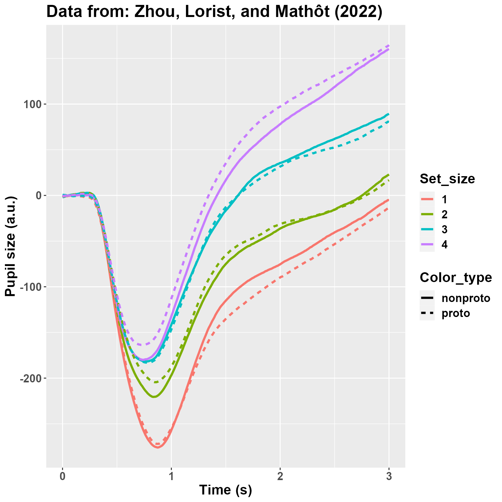
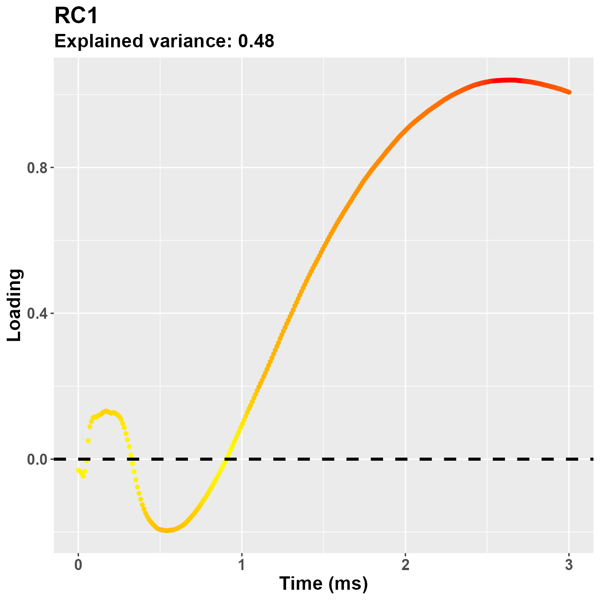
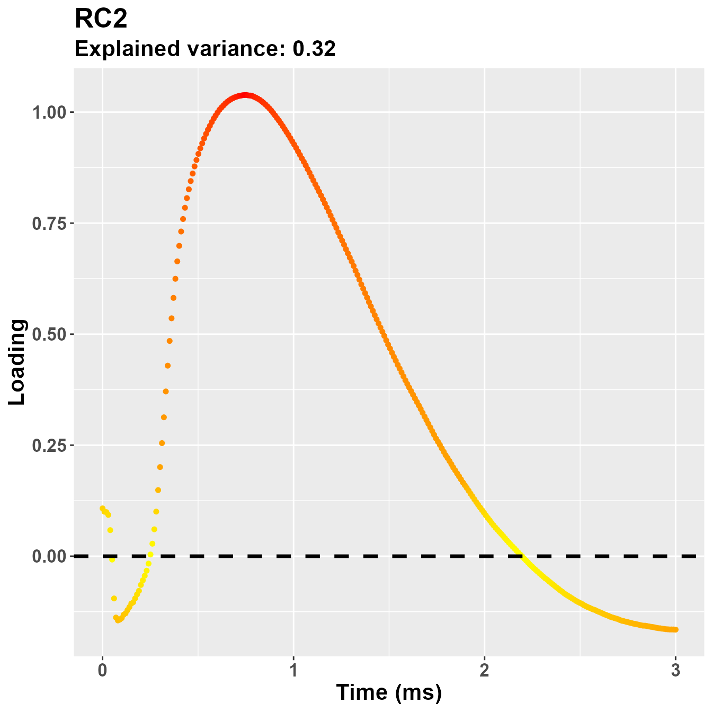

## Introduction

`Pupilla` gathers several functions that are designed to facilitate the analysis of pupillometry experiments as commonly performed in cognitive neuroscience, e.g. event-related designs, although its use could be much more general.
In this vignette we cover the statistical modelling step. `Pupilla` provides functions to implement two approaches:

  1. Crossvalidated LMEMs as in [Mathôt & Vilotijević, 2022](https://link.springer.com/article/10.3758/s13428-022-01957-7). 
    
  2.  An original - and thus not yet fully validated in scientific articles - approach through feature reduction.
  
We will use the data from [Zhou et al., 2022](https://onlinelibrary.wiley.com/doi/full/10.1111/cogs.13194) for a better comparison - there are indeed differences in the implementation of LMEMs in R and Python, on top of course of the specific choices that I've made within this package.

I am grateful to the authors for sharing their data and allowing us to do reproducible, exploitable science.

## Prepping the data

We will need the following R packages:


```r
library("dplyr")
```

```
## 
## Attaching package: 'dplyr'
```

```
## The following objects are masked from 'package:stats':
## 
##     filter, lag
```

```
## The following objects are masked from 'package:base':
## 
##     intersect, setdiff, setequal, union
```

```r
library("Pupilla")
library("ggplot2")
library("emmeans")
library("lmerTest")
```

```
## Loading required package: lme4
```

```
## Loading required package: Matrix
```

```
## 
## Attaching package: 'lmerTest'
```

```
## The following object is masked from 'package:lme4':
## 
##     lmer
```

```
## The following object is masked from 'package:stats':
## 
##     step
```

```r
library("zoo")
```

```
## 
## Attaching package: 'zoo'
```

```
## The following objects are masked from 'package:base':
## 
##     as.Date, as.Date.numeric
```

```r
options(dplyr.summarise.inform = FALSE)
```

For the python interface:


```r
library("reticulate")

# #create python environment
#conda_create("my_env")
#use_miniconda("my_env")

# #install packages in the environment
# py_install("pandas")
# py_install("datamatrix")
```

Note that package `reticulate` requires a python environment and the installation of the required modules. This package is only needed to read `.pkl` files directly from within R, that is the original format of the data.  
Accordingly, the following chunk is run with python as engine - that is, you need to include it within a reticulate repl if not using markdown. We use it to read the [original data](https://github.com/smathot/time_series_test), convert it to a `pandas` dataframe, and then move it the R environment.


```python
from datamatrix import io, convert

address= "data\\zhou_et_al_2021.pkl"

data= io.readpickle(address)

data= convert.to_pandas(data)

quit
```

The python environment is available to R as `py`. We can thus manipulate the data with the usual functions. In particular, the variable `pupil` is read as an array, whereas we would prefer a long dataframe in R. We thus reshape a bit the data as follows - based on my understanding of the structure:


```r
DF= py$data #bring to R

DF2 = lapply(1:nrow(DF), function(x) {
  res = data.frame(
    Pupil = as.vector(DF$pupil[[x]]),
    Set_size = DF$set_size[x],
    Subject = DF$subject_nr[x],
    Color_type = DF$color_type[x],
    Time = seq(0, 3, length = 300)
  )
  
  return(res)
  
})

DF2= do.call(rbind, DF2)
```

We further add an explicit "Trial" variable to the data. The variable "Set_Size" is also converted to a factor.


```r
DF2= DF2 %>% 
  group_by(Subject, Time) %>% 
  mutate(Trial= 1:n())

DF2= data.frame(DF2)

DF2$Set_size= as.factor(DF2$Set_size)
```

There are a few `NA` in the data. It is generally not problematic for LMEMs, which can handle very well slightly unbalanced designs, and these values could be very well omitted. It is slightly more problematic for the second approach, through features reduction, in that missing values may lead to the loss of an entire trial. For this approach, some sort of interpolation would be warranted if, of course, the gaps are not too large. 
For this vignette we simply interpolate the missing values linearly through `zoo::na.approx()`. Note that this function will not work when NAs are located at the beginning or the end of a vector, so that we won't get rid of all NAs.


```r
sum(is.na(DF2$Pupil))
```

```
## [1] 35786
```

```r
DF2= DF2 %>% 
  group_by(Subject, Trial) %>% 
  mutate(Pupil= zoo::na.approx(Pupil, na.rm = F))

sum(is.na(DF2$Pupil))
```

```
## [1] 2009
```

We then plot the average pupil size by Set_Size and Color_type. The plot looks quite like the [original one](https://github.com/smathot/time_series_test), so that we sould not be too far off from the original data.  


```r
DF2 %>% 
  group_by(Subject, Time, Color_type, Set_size) %>% 
  summarise(Pupil= mean(Pupil, na.rm= T)) %>%
  group_by(Time, Color_type, Set_size) %>% 
  summarise(Pupil= mean(Pupil)) %>%
  mutate(Set_size= as.factor(Set_size)) %>% 
  ggplot(aes(y= Pupil, x= Time, 
             color= Set_size, 
             linetype= Color_type,
             group = interaction(Set_size, Color_type))) +
  geom_line(linewidth= 1.2) +
  theme(text= element_text(size= 16,
                           face="bold")) +
  xlab("Time (s)") +
  ylab("Pupil size (a.u.)") +
  ggtitle("Data from: Zhou, Lorist, and Mathôt (2022)")
```



I am not really depicting the variability. However, what matters here is that: 1) there is a very large effect of Set_Size; 2) there may be (well, we know from the paper that there is, :) ) an interaction between Set_Size and Color_type so that the effect of the non-prototypical color is reversed between 1 and 4. Let's analyze the data!

## Crossvalidated LMEMs

In this approach [Mathôt & Vilotijević, 2022](https://link.springer.com/article/10.3758/s13428-022-01957-7), all trials from each participant are assigned deterministically to one of N folds. N-1 folds are circularly used as the training set; here, LMEMs are performed for each timepoint, and the timepoint having the peak t-value (for each fixed effect or interaction) is then used in the test set to confirm the overall consistency of the target effect across folds. 
This approach is computationally efficient and very powerful in suggesting the presence of a consistent experimental effect *somewhere* along the time course of the trials. 
This is how you would do it in `Pupilla`.


```r
#the data
data= DF2
#lme4::lmer-style formula 
#here we use only random intercepts
formula= "Pupil ~ Set_size*Color_type + (1|Subject)"
#you also have to supply explicitly the names of the variables
dv= "Pupil"
time= "Time"
id= "Subject"
trial= "Trial"
#how many folds?
nfolds= 3
#used for the consensus across folds - see below
t_thresh= 1.9
consensus_thresh = 0.99

cv= decode_signal(data= data, 
                  formula= formula,
                  dv= dv,
                  time= time,
                  id= id,
                  trial= trial,
                  nfolds= nfolds,
                  t_thresh= t_thresh,
                  consensus_thresh= consensus_thresh)
```

```
## boundary (singular) fit: see help('isSingular')
## boundary (singular) fit: see help('isSingular')
```

That's it!
We first take a look at the global effects, with LMEMs tested at the relative peaks:


```r
cv$Peaks_test
```

```
##                      Effect      Test_t    Test_df       Test_p
## 1               (Intercept) -12.0345532   31.90004 2.127767e-13
## 2                 Set_size2   7.4219908 7276.01675 1.284641e-13
## 3                 Set_size3  14.4253720 7276.01727 1.564918e-46
## 4                 Set_size4  12.6268559 7263.07280 3.595688e-36
## 5           Color_typeproto  -1.5116082 7269.07742 1.306770e-01
## 6 Set_size2:Color_typeproto   0.8674076 7270.09839 3.857473e-01
## 7 Set_size3:Color_typeproto   1.0893240 7273.07358 2.760471e-01
## 8 Set_size4:Color_typeproto   2.4009727 7273.04856 1.637651e-02
```

First, you may notice that results are taken from `lmerTest::lmer()` and reflect the default contrast settings of R, that is **treatment coding**. In other words, in the case of factors the first level is taken as the reference. In this case it's pretty clear for us as we aim to compare Set_size 1 vs 4; if you want to compare explicity other contrasts, you would have to refactor the variables. In my understanding other packages may perform "omnibus tests"; in R this is very feasible, e.g. with `car::Anova()`, and perhaps will be implemented in the feature. The interpretation here, however, is not that of an omnibus test (e.g., a main effect in the ANOVA), but that of specific comparisons.   
You will also notice that the main inferential statistic is a t value, rather than a z or F value.

That said, the results are positive for Set_size (each differs from 1) and the interaction with Color_type between Set_size 1 and 4. This would therefore be taken as evidence for the presence of an effect *somewhere* along the time course of trials. 

The following table reports statistics for each fold, *when the fold was left out*. This is useful to understand where the peaks were located.


```r
cv$All_Folds
```

```
##    Fold                    Effect     Peak_t Peak_obs  Peak_time
## 1     1               (Intercept) -12.141355       89 0.88294314
## 2     2               (Intercept) -11.509067       87 0.86287625
## 3     3               (Intercept) -12.037152       89 0.88294314
## 4     1                 Set_size2   6.233502       95 0.94314381
## 5     2                 Set_size2   5.663626       89 0.88294314
## 6     3                 Set_size2   7.076464       97 0.96321070
## 7     1                 Set_size3  12.371973       98 0.97324415
## 8     2                 Set_size3  11.366762       98 0.97324415
## 9     3                 Set_size3  11.770977       97 0.96321070
## 10    1                 Set_size4  13.232442      103 1.02341137
## 11    2                 Set_size4  12.609223      282 2.81939799
## 12    3                 Set_size4  13.366514      221 2.20735786
## 13    1           Color_typeproto  -2.484261      167 1.66555184
## 14    2           Color_typeproto  -2.121288      159 1.58528428
## 15    3           Color_typeproto   1.807755        5 0.04013378
## 16    1 Set_size2:Color_typeproto   2.398834      165 1.64548495
## 17    2 Set_size2:Color_typeproto   2.987624      156 1.55518395
## 18    3 Set_size2:Color_typeproto  -1.623268        7 0.06020067
## 19    1 Set_size3:Color_typeproto   1.707470      158 1.57525084
## 20    2 Set_size3:Color_typeproto   2.071359      146 1.45484950
## 21    3 Set_size3:Color_typeproto  -2.007344        8 0.07023411
## 22    1 Set_size4:Color_typeproto   3.216884      171 1.70568562
## 23    2 Set_size4:Color_typeproto   2.794211      159 1.58528428
## 24    3 Set_size4:Color_typeproto   1.950378      142 1.41471572
```

First, the comparisons with Set_size 1 vs 2 or 3 are similar in locating peaks around 1 second. Results are slightly more sparse for the 1 vs 4 comparison (1 to 2.8 s).
We did not find a main effect of Color_type here. This could be due to the contrasts used, to differences in how trials are assigned to folds, the presence of possible convergence failures, etc. You will see, for example, that t values for the main effect of Color_type are positive in two folds, negative in the other one. This could be due, again, to some funny convergence, or simply the fact that overfitting occurrred in one specific time point (sample 5). Below we will introduce the notion of **consensus** across folds.
Finally, the interaction is also seemingly very consistent between 1.4 and 1.7 seconds.

Overall, it seems to me that there is a good agreement with the original findings, notwithstanding the differences in the implementation.

There are, however, a couple of caveats, that are also mentioned by [the authors](https://github.com/smathot/time_series_test). 

First, the temporal information provided by this approach is rather coarse. It can test the presence of an effect *somewhere* along the course of the trial, though the specific timepoints may be rather vague.

Second, in the presence of two distinct loci of effects, this approach would not be entirely appropriate, especially if the direction of these effects is in the opposite direction.

Finally, because the tested time point is chosen as the one having the peak statistic (e.g., t value), the approach may be prone to overfitting; other time points may be, in fact, more representative of the effects at hand.

### Consensus

It is a common problem, in machine learning, having to find a consensus between the hyperparameters obtained in different folds. Particularly so if you need to build one final model to interpret the results (see, e.g., my other package [FCnet](https://eblini.github.io/FCnet/articles/FCnet_overview_of_package.html) for the analysis of neuroimaging data through elastic nets). 

Long story short, one possible solution that is put forward in `Pupilla` is quite simple, though arbitrary: we simply keep track of the timepoints that are associated to a given threshold, e.g. a t statistic of 1.9 as in this case, and we consider them to be in agreement across folds if... these time points show up consistently across folds! It's as simple as that. In this specific example we ask for all folds to be in agreement (>99%), meaning that all timepoints must remain significant regardless of which fold is left out from the data. (This is to ensure that none of the folds has particular leverage in driving the overal results).
For the effects that we have specified, was there a consensus across folds?


```r
cv$Consensus
```

```
## $`(Intercept)`
##   [1]  33  34  35  36  37  38  39  40  41  42  43  44  45  46  47  48  49  50  51  52  53  54  55  56  57  58  59  60  61  62  63  64  65  66  67  68  69  70  71  72  73  74  75  76  77  78  79  80  81  82  83  84  85  86  87  88  89  90  91  92  93  94  95  96  97  98  99 100 101 102 103 104 105 106 107 108 109 110 111 112 113 114 115 116 117 118 119 120 121 122 123 124 125 126 127 128 129 130 131 132 133 134 135 136 137 138 139 140 141 142 143 144 145 146 147 148 149 150 151 152 153 154 155 156 157 158 159 160 161 162 163 164 165 166 167 168 169 170 171 172 173 174 175 176 177 178 179 180 181 182 183 184 185 186 187 188 189 190 191 192 193 194 195 196 197 198 199 200 201 202 203 204 205 206 207 208 209 210 211 212 213 214 215 216 217 218 219 220 221 222 223 224 225 226 227 228 229 230 231 232 233 234 235 236 237 238 239 240 241 242 243 244 245 246 247 248 249 250 251 252 253 254 255 256 257 258 259
## 
## $Set_size2
##   [1]  58  59  60  61  62  63  64  65  66  67  68  69  70  71  72  73  74  75  76  77  78  79  80  81  82  83  84  85  86  87  88  89  90  91  92  93  94  95  96  97  98  99 100 101 102 103 104 105 106 107 108 109 110 111 112 113 114 115 116 117 118 119 120 121 122 123 124 125 126 127 128 129 130 131 132 133 134 135 136 137 138 139 140 141 142 143 144 145 146 147 148 149 150 151 152 153 154 155 156 157 158 159 160 161 162 163 164 165 166 167 168 169 170 171 172 173 174 175 176 178
## 
## $Set_size3
##   [1]  47  48  49  50  51  52  53  54  55  56  57  58  59  60  61  62  63  64  65  66  67  68  69  70  71  72  73  74  75  76  77  78  79  80  81  82  83  84  85  86  87  88  89  90  91  92  93  94  95  96  97  98  99 100 101 102 103 104 105 106 107 108 109 110 111 112 113 114 115 116 117 118 119 120 121 122 123 124 125 126 127 128 129 130 131 132 133 134 135 136 137 138 139 140 141 142 143 144 145 146 147 148 149 150 151 152 153 154 155 156 157 158 159 160 161 162 163 164 165 166 167 168 169 170 171 172 173 174 175 176 177 178 179 180 181 182 183 184 185 186 187 188 189 190 191 192 193 194 195 196 197 198 199 200 201 202 203 204 205 206 207 208 209 210 211 212 213 214 215 216 217 218 219 220 221 222 223 224 225 226 227 228 229 230 231 232 233 234 235 236 237 238 239 240 241 242 243 244 245 246 247 248 249 250 251 252 253 254 255 256 257 258 259 260 261 262 263 264 265 266 267 268 269 270 271 272 273 274 275 276 277 278 279 280 281 282 283 284 285 286 287 288 289 290 291 292 293 294
## [249] 295 296 297 298 299 300
## 
## $Set_size4
##   [1]  49  50  51  52  53  54  55  56  57  58  59  60  61  62  63  64  65  66  67  68  69  70  71  72  73  74  75  76  77  78  79  80  81  82  83  84  85  86  87  88  89  90  91  92  93  94  95  96  97  98  99 100 101 102 103 104 105 106 107 108 109 110 111 112 113 114 115 116 117 118 119 120 121 122 123 124 125 126 127 128 129 130 131 132 133 134 135 136 137 138 139 140 141 142 143 144 145 146 147 148 149 150 151 152 153 154 155 156 157 158 159 160 161 162 163 164 165 166 167 168 169 170 171 172 173 174 175 176 177 178 179 180 181 182 183 184 185 186 187 188 189 190 191 192 193 194 195 196 197 198 199 200 201 202 203 204 205 206 207 208 209 210 211 212 213 214 215 216 217 218 219 220 221 222 223 224 225 226 227 228 229 230 231 232 233 234 235 236 237 238 239 240 241 242 243 244 245 246 247 248 249 250 251 252 253 254 255 256 257 258 259 260 261 262 263 264 265 266 267 268 269 270 271 272 273 274 275 276 277 278 279 280 281 282 283 284 285 286 287 288 289 290 291 292 293 294 295 296
## [249] 297 298 299 300
## 
## $Color_typeproto
## numeric(0)
## 
## $`Set_size2:Color_typeproto`
## numeric(0)
## 
## $`Set_size3:Color_typeproto`
## numeric(0)
## 
## $`Set_size4:Color_typeproto`
##  [1] 136 138 139 141 142 143 144 145 146 147
```

Yes! The consensus was very clear for each contrast within Set_size **and** for the interaction with Color_type (1 vs 4), in the latter case between sample 136 and 147. We can then formally test the consensus window with another LMEM:


```r
cv$Consensus_test
```

```
##                      Effect    Test_t    Test_df       Test_p
## 1               (Intercept) -2.447735   44.98978 0.0183421194
## 2                 Set_size2  3.543109 7276.01207 0.0003979187
## 3                 Set_size3  3.052632 7276.01359 0.0022766268
## 4                 Set_size4  2.915928 7276.01471 0.0035571531
## 5           Color_typeproto        NA         NA           NA
## 6 Set_size2:Color_typeproto        NA         NA           NA
## 7 Set_size3:Color_typeproto        NA         NA           NA
## 8 Set_size4:Color_typeproto  2.685758 7274.04215 0.0072529680
```

From which, again, the presence of an effect is confirmed.

To summarise, this approach has the advantage of returning a more precise time window for the given experimental effect; it maintains the computational efficiency of the crossvalidated approach; it is capable to highlight potentially clusters that are not contiguous.

The downside is that few very arbitrary choices - e.g., the threshold for the statistic - must be specified beforehand. My personal take on the matter is that we, as researchers, should start being more comfortable with our degrees of freedom, which are unavoidable in our job, embrace them, and just resolve to tranparently report our choices and avoid overselling stuff. But I get it, we are not really ingrained to do that. Keep in mind that, however, this conflict can be resolved very elegantly by preregistration of the experimental methods. 
At any rate, this would be too long of a discussion for this vignette. Let's introduce the second approach pursued by `Pupilla`: **features reduction**.

## Feature reduction

We live in a time of big data. As a result, it is often necessary (and very empowering) to reduce the dimensions of the initial data to few, much more manageable features that preserve most of the original variability. For example through Principal components analysis or Independent Components Analysis very rich data (e.g., neuroimaging) can be reduced to very few features, which can then enter multivariate analyses (see, e.g., [FCnet](https://eblini.github.io/FCnet/articles/FCnet_overview_of_package.html)). 
The same can be done with pupillometry data. In fact, because pupil dilation is strongly autocorrelated in time, this approach is potentially very effective. `Pupilla::reduce_PCA()` and `Pupilla::reduce_ICA()` attempt to do that by summarising each trial in very few scores; the scores reflect the contribution of pupil diameter at each time point, weighted by the loadings matrix. The loadings  vary as a function of the importance of the contribution of each time point, thus capturing some sort of relevant pattern in the data. 

The notation to do this in `Pupilla` is very similar to what used above:


```r
#the data
data= DF2
#variables names should be supplied explicitly 
dv= "Pupil"
time= "Time"
id= "Subject"
trial= "Trial"
#append to the reduced dataframe
add= c("Set_size", "Color_type")

rf = reduce_PCA(
  data = data,
  dv = dv,
  time = time,
  id = id,
  trial = trial,
  add = add
)
```

```
## Warning in reduce_PCA(data = data, dv = dv, time = time, id = id, trial = trial, : NAs in the data will be discarded:
##             check the data!
```

We have used PCA (though ICA would be very similar in this specific case). As we can see the approach is tremendously effective in reducing the data, because only 2 components can explain more than 90% of the original data! This means that we can summarise down each trial and describe fairly well the pattern of pupil dilation with only 2 values!


```r
rf$summaryPCA[,1:4]
```

```
##                               PC1        PC2       PC3       PC4
## Standard deviation     3229.38700 1941.74683 722.69764 489.68396
## Proportion of Variance    0.67641    0.24454   0.03388   0.01555
## Cumulative Proportion     0.67641    0.92096   0.95483   0.97039
```

Generally speaking the first component captures the main axis of variability, and ends up describing at best the overall shape of the curves seen in the original plot above. We can depict it as:


```r
plot_loadings("PC1", rf)
```


The loadings suggest that the first PC captures an overall dilation/constriction occurring in the late stages of the trial, after 1 second. (Keep in mind that the sign of the loadings is completely arbitrary, this plot could very well be reversed, but we know from the data that it probably refers to dilation.)
Then, the following components gruadually capture the remaining variability, e.g.:


```r
plot_loadings("PC2", rf)
```


Meaning that the more you go on, the more you are likely to capture very idiosincratic (and very small) trial-wise changes. It is not really the case for this second component (24% of the variance explained), which captures very well what is likely to be an initial response, e.g. the pupillary light reflex. 
A note about the interpretation: because PCA is a descriptive model, it does not imply any underlying, originating process. The interpretation part is completely up to the experimenter. This would be the case, however, for any inferential technique. And for most uses, the shape of the loadings plot is more likely to highlight segregated, at least partially independent processes.

We move forward by assessing, thus, the obtained scores. Scores can be, of course, summarised per subject to perform classic ANOVAs, or used as such within LMEMs. We choose the second approach for now, though we still summarise the data for depiction purposes.


```r
#summarise scores
Scores= rf$Scores %>% 
  group_by(id, Set_size, Color_type) %>% 
  summarise(PC1= mean(PC1),
            PC2= mean(PC2))
Scores$Set_size= as.factor(Scores$Set_size)
rf$Scores$Set_size= as.factor(rf$Scores$Set_size)
```

### PC1

We can fit a LMEM model for the first PC:


```r
mod_pc1= lmer(PC1 ~ Color_type*Set_size + (1|id),
              rf$Scores) #note that we used the original dataframe
summary(mod_pc1)
```

```
## Linear mixed model fit by REML. t-tests use Satterthwaite's method ['lmerModLmerTest']
## Formula: PC1 ~ Color_type * Set_size + (1 | id)
##    Data: rf$Scores
## 
## REML criterion at convergence: 134493.4
## 
## Scaled residuals: 
##     Min      1Q  Median      3Q     Max 
## -4.9087 -0.6031  0.0047  0.6025  5.8052 
## 
## Random effects:
##  Groups   Name        Variance Std.Dev.
##  id       (Intercept) 1662005  1289    
##  Residual             7524608  2743    
## Number of obs: 7202, groups:  id, 30
## 
## Fixed effects:
##                           Estimate Std. Error       df t value Pr(>|t|)    
## (Intercept)               -1813.69     252.48    36.97  -7.184 1.62e-08 ***
## Color_typeproto            -179.27     129.73  7165.06  -1.382   0.1670    
## Set_size2                   608.64     129.25  7165.04   4.709 2.54e-06 ***
## Set_size3                  1564.30     128.97  7165.05  12.129  < 2e-16 ***
## Set_size4                  2146.06     129.19  7165.08  16.612  < 2e-16 ***
## Color_typeproto:Set_size2   241.04     183.28  7165.05   1.315   0.1885    
## Color_typeproto:Set_size3   119.03     182.78  7165.06   0.651   0.5149    
## Color_typeproto:Set_size4   398.82     183.16  7165.08   2.177   0.0295 *  
## ---
## Signif. codes:  0 '***' 0.001 '**' 0.01 '*' 0.05 '.' 0.1 ' ' 1
## 
## Correlation of Fixed Effects:
##             (Intr) Clr_ty St_sz2 St_sz3 St_sz4 C_:S_2 C_:S_3
## Colr_typprt -0.255                                          
## Set_size2   -0.256  0.498                                   
## Set_size3   -0.256  0.499  0.501                            
## Set_size4   -0.256  0.498  0.500  0.501                     
## Clr_typ:S_2  0.180 -0.708 -0.705 -0.353 -0.352              
## Clr_typ:S_3  0.181 -0.710 -0.353 -0.706 -0.353  0.502       
## Clr_typ:S_4  0.180 -0.708 -0.352 -0.353 -0.705  0.501  0.503
```

To see, again, the large effect of Set_size, and the interaction with Color_type occurring for the 1 vs 4 contrast. With the package `emmeans` we can avoid refactoring to compute all contrasts:


```r
emm_options(lmer.df = "asymptotic")
mm= emmeans(mod_pc1, ~ Color_type:Set_size)
mm
```

```
##  Color_type Set_size emmean  SE  df asymp.LCL asymp.UCL
##  nonproto   1         -1814 252 Inf     -2309     -1319
##  proto      1         -1993 253 Inf     -2488     -1498
##  nonproto   2         -1205 253 Inf     -1700      -710
##  proto      2         -1143 253 Inf     -1638      -648
##  nonproto   3          -249 252 Inf      -744       245
##  proto      3          -310 252 Inf      -804       185
##  nonproto   4           332 252 Inf      -162       827
##  proto      4           552 253 Inf        57      1047
## 
## Degrees-of-freedom method: asymptotic 
## Confidence level used: 0.95
```

```r
contrast(mm, method = "pairwise", interaction = T)
```

```
##  Color_type_pairwise Set_size_pairwise estimate  SE  df z.ratio p.value
##  nonproto - proto    1 - 2                  241 183 Inf   1.315  0.1885
##  nonproto - proto    1 - 3                  119 183 Inf   0.651  0.5149
##  nonproto - proto    1 - 4                  399 183 Inf   2.177  0.0295
##  nonproto - proto    2 - 3                 -122 183 Inf  -0.668  0.5040
##  nonproto - proto    2 - 4                  158 183 Inf   0.862  0.3885
##  nonproto - proto    3 - 4                  280 182 Inf   1.533  0.1252
## 
## Degrees-of-freedom method: asymptotic
```

This is, indeed, the only significant contrast. We can see that there is an inversion in the effect of prototypical / non-prototypical color between the two set sizes.


```r
ggplot(Scores, aes(y= PC1, x= Set_size, fill= Color_type)) +
  geom_boxplot() +
  theme(text= element_text(size= 16,
                           face="bold")) 
```


### PC2

For PC2, on the other hand:


```r
mod_pc2= lmer(PC2 ~ Color_type*Set_size + (1|id), 
              rf$Scores)
summary(mod_pc2)
```

```
## Linear mixed model fit by REML. t-tests use Satterthwaite's method ['lmerModLmerTest']
## Formula: PC2 ~ Color_type * Set_size + (1 | id)
##    Data: rf$Scores
## 
## REML criterion at convergence: 121258.8
## 
## Scaled residuals: 
##     Min      1Q  Median      3Q     Max 
## -5.0713 -0.5643 -0.0062  0.5856  5.9442 
## 
## Random effects:
##  Groups   Name        Variance Std.Dev.
##  id       (Intercept)  473867   688.4  
##  Residual             1192655  1092.1  
## Number of obs: 7202, groups:  id, 30
## 
## Fixed effects:
##                           Estimate Std. Error      df t value Pr(>|t|)    
## (Intercept)                1407.13     130.84   33.35  10.755 2.22e-12 ***
## Color_typeproto             -79.48      51.65 7165.03  -1.539  0.12388    
## Set_size2                  -135.53      51.46 7165.02  -2.634  0.00846 ** 
## Set_size3                    58.57      51.35 7165.03   1.141  0.25401    
## Set_size4                   372.42      51.43 7165.05   7.241 4.92e-13 ***
## Color_typeproto:Set_size2   -24.67      72.97 7165.03  -0.338  0.73534    
## Color_typeproto:Set_size3    37.29      72.77 7165.04   0.512  0.60836    
## Color_typeproto:Set_size4    25.15      72.92 7165.05   0.345  0.73014    
## ---
## Signif. codes:  0 '***' 0.001 '**' 0.01 '*' 0.05 '.' 0.1 ' ' 1
## 
## Correlation of Fixed Effects:
##             (Intr) Clr_ty St_sz2 St_sz3 St_sz4 C_:S_2 C_:S_3
## Colr_typprt -0.196                                          
## Set_size2   -0.196  0.498                                   
## Set_size3   -0.197  0.499  0.501                            
## Set_size4   -0.197  0.498  0.500  0.501                     
## Clr_typ:S_2  0.139 -0.708 -0.705 -0.353 -0.352              
## Clr_typ:S_3  0.139 -0.710 -0.353 -0.706 -0.353  0.502       
## Clr_typ:S_4  0.139 -0.708 -0.352 -0.353 -0.705  0.501  0.503
```

We find no such effect, reiterating that the interaction probably appears later on in the course of the trial.

## Rotated Principal Components Analysis

The loadings can be "rotated" so that: 1) their interpretation is easier (e.g., few timepoints are set closer to 0, some are increased); 2) components are not orthogonal but can correlate. As a result, the model performs slightly worse in terms of explained variance, but may allow one a better, clearer interpretation of the loadings, and may relax some unrealistic assumption such as that different components do not interact (correlate) significantly.
The implementation is outlined below. Please note that while `reduce_PCA()` follows `prcomp()`, this function follows `psych::principal()` including the standardization of the loadings (that is, even `rotate` is `"none"` results differ slightly). 


```r
#the data
data= DF2
#variables names should be supplied explicitly 
dv= "Pupil"
time= "Time"
id= "Subject"
trial= "Trial"
rotate= "promax" #oblique rotation
#append to the reduced dataframe
add= c("Set_size", "Color_type")

rf2 = reduce_rPCA(
  data = data,
  dv = dv,
  time = time,
  id = id,
  trial = trial,
  rotate= rotate,
  add = add
)
```

```
## Warning in reduce_rPCA(data = data, dv = dv, time = time, id = id, trial = trial, : NAs in the data will be discarded:
##             check the data!
```

```
## The determinant of the smoothed correlation was zero.
## This means the objective function is not defined.
## Chi square is based upon observed residuals.
```

```
## The determinant of the smoothed correlation was zero.
## This means the objective function is not defined for the null model either.
## The Chi square is thus based upon observed correlations.
```

Here's how the loadings now look:


```r
plot_loadings("RC1", rf2)
```



```r
plot_loadings("RC2", rf2)
```



So, notwistanding the differences in the implementation of the PCA - based on the covariance matrix for `psych::principal()`, in this case the second component is more clearly referring to the early part of the trial, presumably PLR.

## Discussion

The aim of this vignette was to present the two main analytical approaches of `Pupilla`. I am not familiar enough with the domain of the original study to adventure myself in theoretical interpretations. Suffice to say that, in my opinion, the crossvalidation approach appears to replicate quite well - notwithstanding differences in the implementation - the results reported by the authors. Furthermore, an argument could be made about the utility of a *consensus* across folds to enhance the precision in identifying a temporal cluster.
For what concerns the second approach, i.e. via feature reduction, we have also seen pretty coherent results. I would not go as far as saying that the loadings of PC1 can identify a temporal cluster. In a sense, they would, though not of course a dichotomic one, but rather a much more graded, continuous one. All I care to say here, however, is that this approach could represent a viable option for when the collected data is really huge, in that it would allow one to obtain few, much more manageable variables that can be further exploited for all sorts of modelling purposes. Furthermore, these variables may be more easy to interpret - albeit this is, however, still to better understand with more research.

## Appendix

Packages' versions:


```r
sessionInfo()
```

```
## R version 4.2.3 (2023-03-15 ucrt)
## Platform: x86_64-w64-mingw32/x64 (64-bit)
## Running under: Windows 10 x64 (build 19045)
## 
## Matrix products: default
## 
## locale:
## [1] LC_COLLATE=Italian_Italy.utf8  LC_CTYPE=Italian_Italy.utf8    LC_MONETARY=Italian_Italy.utf8 LC_NUMERIC=C                   LC_TIME=Italian_Italy.utf8    
## 
## attached base packages:
## [1] stats     graphics  grDevices utils     datasets  methods   base     
## 
## other attached packages:
##  [1] zoo_1.8-12         lmerTest_3.1-3     lme4_1.1-35.1      Matrix_1.6-5       emmeans_1.10.0     ggplot2_3.4.4      dplyr_1.1.4        usethis_2.2.2      pkgdown_2.0.7      Pupilla_0.0.0.9001
## 
## loaded via a namespace (and not attached):
##  [1] tidyr_1.3.1         jsonlite_1.8.8      splines_4.2.3       askpass_1.2.0       highr_0.10          yaml_2.3.8          numDeriv_2016.8-1.1 pillar_1.9.0        lattice_0.22-5      glue_1.7.0          reticulate_1.35.0   digest_0.6.34       minqa_1.2.6         colorspace_2.1-0    sandwich_3.1-0      htmltools_0.5.7     psych_2.4.1         pkgconfig_2.0.3     purrr_1.0.2         xtable_1.8-4        gitcreds_0.1.2      mvtnorm_1.2-4       scales_1.3.0        processx_3.8.3      tibble_3.2.1        openssl_2.1.1       farver_2.1.1        generics_0.1.3      TH.data_1.1-2       cachem_1.0.8        withr_3.0.0         credentials_2.0.1   cli_3.6.2           mnormt_2.1.1        survival_3.5-3      magrittr_2.0.3      crayon_1.5.2        memoise_2.0.1       estimability_1.4.1  evaluate_0.23       ps_1.7.6            fs_1.6.3            fansi_1.0.6         nlme_3.1-162        MASS_7.3-58.2       ica_1.0-3           httr2_1.0.0         tools_4.2.3         gh_1.4.0           
## [50] lifecycle_1.0.4     multcomp_1.4-25     gert_2.0.1          munsell_0.5.0       callr_3.7.3         compiler_4.2.3      rlang_1.1.3         grid_4.2.3          nloptr_2.0.3        rstudioapi_0.15.0   sys_3.4.2           rappdirs_0.3.3      labeling_0.4.3      rmarkdown_2.25      boot_1.3-28.1       gtable_0.3.4        codetools_0.2-19    curl_5.2.0          R6_2.5.1            knitr_1.45          fastmap_1.1.1       utf8_1.2.4          rprojroot_2.0.4     desc_1.4.3          parallel_4.2.3      Rcpp_1.0.12         vctrs_0.6.5         png_0.1-8           tidyselect_1.2.0    xfun_0.41           coda_0.19-4.1
```


