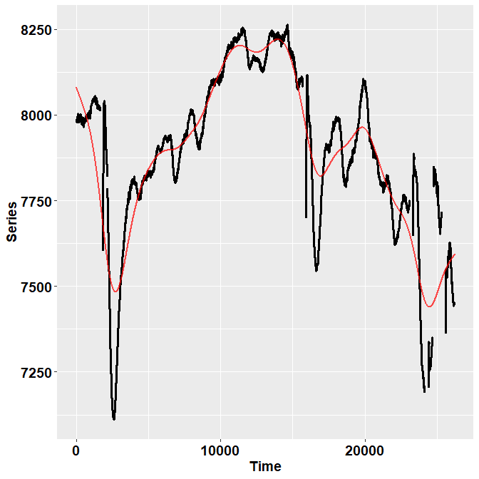
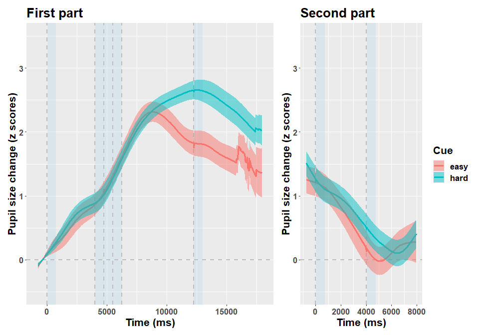

## Introduction

`Pupilla` gathers several functions that are designed to facilitate the analysis of pupillometry experiments as commonly performed in cognitive neuroscience, e.g. event-related designs, although its use could be much more general.

The typical analysis pipeline would, coarsely, include the following steps:

  1.    **Read the data.** This part can vary a lot depending on the eyetracker used, the individual OS, local paths, how the experiment was coded, etc. `Pupilla` does provide utility functions to read from common eyetrackers (e.g., TOBII, EyeLink) but clearly this passage will need to be tailored to your files.
  
  2.    **Prepare the data.** As above, this part may need to be tailored to your specific needs; however, several steps are very common across pipelines, and will be presented in this vignette.
  
  3.    **Preprocessing.** Pupillometry needs robust preprocessing of the raw data, in order to reduce noise and artifacts (such as those due to blinks). Once the data is properly prepared, this aspect can be translated across several different scenarios. Of course, flexibility and adapting to your own data is warmly advised.
  
  4.    **Statistical modelling**. `Pupilla` offers two approaches: 1) crossvalidated LMEMs as in [Mathôt & Vilotijević, 2022](https://link.springer.com/article/10.3758/s13428-022-01957-7)); and 2) an original approach through feature reduction. This vignette does not cover the analysis step.

In this vignette we focus on how to read and preprocess data from a single participant, tested with an EyeLink 1000. There are multiple differences that may arise in the pipeline, according to the specific rationale of the experiment and difference in the coding implementation. These functions have been written having OpenSesame in mind.
For this example we use data from [Blini et al., 2023](https://www.biorxiv.org/content/10.1101/2023.12.15.571819v1). Data can be retrieved from the associated [OSF repository](https://osf.io/szb24/). 

In this study 70 participants (following exclusions) were given an arithmetic task, preceded by an auditory cue ("easy" or "hard") prompting the corresponding difficulty. After a response phase of variable length, they were given an auditory feedback. All in all, each trial lasted several seconds. Details are provided in the accompanying paper, what matters here is that participants were found to have pupillary **dilation** depending on trial difficulty, that is a very classic result. 
We focus on the data of one participant. 

Please note that the pipeline and the default parameters in `Pupilla` have been changing in the early development phase, so that results may be slightly different from what reported elsewhere. 

## Read the data

The library `Pupilla` must be installed first, and only once, through `devtools`:


```r
#install.packages("devtools")
devtools::install_github("EBlini/Pupilla")
```

Dependencies will be installed automatically.
We will then need to load the following packages:


```r
library("Pupilla")
library("dplyr") 
library("ggplot2") 
library("tidyr")

options(dplyr.summarise.inform = FALSE)
```


The following steps in this section vary a lot as a function of the software used for the presentation of the stimuli and your machine. `Pupilla` is tested on windows machines, you may thus have troubles using the utility functions to read all participants altogether. But this is how you would do in Windows:


```r
#set your own working directory first!
#wd= choose.dir()

subject= 10 #vector of ids; only 1 for this example

#as coded in the program - these are the relevant eyelink messages
keep_events = c(
  "fixation",
  "cue",
  "target1",
  "sign",
  "target2",
  "calculation",
  "response",
  "post_resp_fix",
  "Wait_Feedback",
  "feedback"
)

#read 
data= read_eyelink(subject, keep_events, 
                   path = wd)

#split for eyetracker and behavioral data
ET= data$ET
BD= data$BD

ET$Subject= subject
BD$Subject= subject
```

As you can see: 

1) a working directory has been set - change yours!; 
2) we only ask for a specific participant here, but a vector of IDs could be supplied; each participant comes with two files because by default OpenSesame splits the eyetracker and behavioral files.
3) We supplied directly a character vector of events - defined in the OpenSesame script) that included the relevant phases of the trial. Only datapoints that belong to these phases are kept. This is mandatory at this stage. 

So, reading the files should be straightforward. If this utility function does not work for you, however, just assume that it works by iterating `eyelinkReader::read_edf()` across (eyetracking) files.
In order to use the excellent `eyelinkReader` package, you must have installed the SR research-EyeLink plugins, which you can download from their forum upon registration (these functions are also needed to control the eyelink).

## Prepare the data

I have the bad (?) habit to only record essential info in the eyetracker file, :)

As a result, very often variables that are only present in the behavioral file (e.g., response time, condition) must be copied to the eyetracker file, which has very different dimensions (several lines per trial, depending on sampling rate). `Pupilla` has utility functions to do precisely that. 

Specifically, from the behavioral data (BD) we report the variables Phase, Accuracy, Cue, etc.


```r
#whether it's practice or experiment
ET$Phase = copy_variable(
  "Phase",
  id_var = "Subject",
  constrained_var = "trial",
  larger_df = ET,
  smaller_df = BD
)
#result of the problem
ET$Result = copy_variable(
  "Result",
  id_var = "Subject",
  constrained_var = "trial",
  larger_df = ET,
  smaller_df = BD
)
#response
ET$Response = copy_variable(
  "response",
  id_var = "Subject",
  constrained_var = "trial",
  larger_df = ET,
  smaller_df = BD
)
#set accuracy
ET$Accuracy = ifelse(ET$Response == ET$Result,
                     "correct",
                     "incorrect")
#condition
ET$Cue = copy_variable(
  "Cue",
  id_var = "Subject",
  constrained_var = "trial",
  larger_df = ET,
  smaller_df = BD
)
```


We discard practice trials:


```r
ET= ET[ET$Phase== "experiment",]
BD= BD[BD$Phase== "experiment",]
```

In this experiment, we were recording the left eye only. We thus set the Pupil area as the corresponding variable:


```r
ET$Pupil= ET$paL
```

We set to NA when Pupil values are 0. This is mandatory for the preprocessing functions that follow. Also, although this is very often automatic, we only retain data samples in which a fixation was recorded by the eyelink. 


```r
#very important, set zeros to NA for preprocessing
ET$Pupil= ifelse(ET$Pupil==0, NA, ET$Pupil)

ET$Pupil[ET$is_Fixation==0]= NA
```


Next, I generally remove values that exceed a certain threshold, e.g. < - 2.5 standard deviation from the subject's mean (considering all samples).


```r
cut_off= mean(ET$Pupil, na.rm= T) - 2.5*sd(ET$Pupil, na.rm= T)
ET$Pupil= ifelse(ET$Pupil < cut_off, NA, ET$Pupil)
```

We can now realign the timestamps to the first sample of the initial phase. Then, we downsample to 20 ms bins.  


```r
ET= ET %>% 
  group_by(trial) %>% 
  mutate(Time= time-time[Event== "fixation"][1]) 
```


## Preprocessing

We can finally move to the real thing!
The signal must be **processed** so that the impact of artifacts, blinks, etc. is reduced. The easiest way to do that in `Pupilla` would be to use the `pre_process()` function. You may want, however, to consider whether the specific default parameters are applicable to your data. For a description of the parameters, see `?pp_options()`. You can always change the default parameters by calling the options globally, other than within the function itself. E.g.:


```r
#the default parameters:
pp_options()
```

```
## $thresh
## [1] 3
## 
## $speed_method
## [1] "z"
## 
## $extend_by
## [1] 25
## 
## $island_size
## [1] 4
## 
## $extend_blink
## [1] 25
## 
## $overall_thresh
## [1] 0.4
## 
## $consecutive_thresh
## NULL
## 
## $spar
## [1] 0.8
```

```r
pp_options("extend_by"= 25) #strip 50 ms before and after blinks
pp_options("extend_blink"= 25) #further extend prior to interpolation
pp_options("spar"= 0.8) #smoothing parameter
```

Once checked the defaults, preprocessing only requires:


```r
#entire preprocessing
ET= ET %>%
  group_by(Subject, trial) %>%
  mutate(Pupil_pp= pre_process(Pupil, Time))
```

And that's it! You can **check** the result of the pipeline visually as follows:


```r
ET %>% filter(Subject==10 & trial== 13) %>%
  check_series("Pupil", "Pupil_pp", "Time")
```



Or you can use the function `Pupilla::check_all_series()` to have all the plots (that is, for all ids and trials) saved as images in your path.

In the image, the black dots represent the raw, initial data. The red line depicts instead the reconstructed, preprocessed signal. `pre_process()` simply runs, in order, functions for deblinking (through a velocity-based criterion), interpolation, and smoothing through cubic splines. Trials in which data points do not reach a given quality threshold are set to NA; trials that can be recovered are, instead, recovered.

So, for those trials in which we couldn't restore a reliable signal, we simply discard them!


```r
#drop
ET= ET %>% filter(!is.na(Pupil_pp))
```

Another common step is **downsampling**, we choose bins of 20 ms:


```r
ET$Time= downsample_time(ET$Time, 20)

#summarise the data for the new binned variable
ET= ET %>%
  group_by(Subject, Cue, Event, 
           trial, Time, Accuracy) %>%
  summarise(Pupil= median(Pupil_pp, na.rm = T))
```

Next, I personally prefer to work with **z-scores** instead of arbitrary units or mms, as to have a standardized measure. So:


```r
#z scores
ET$Pupil_raw= ET$Pupil

ET= ET %>%
  group_by(Subject, trial) %>%
  mutate(Pupil= ((Pupil - mean(Pupil[Event!= "response"]))/sd(Pupil[Event!= "response"])))
```

In this particular case I did not include the response phase because of the motor artifacts (verbal response and blinks allowed), but this should not alter much the pattern of the results.

If needed, we can remove here trials in which the starting pupil size was particularly extreme.


```r
deviant_baseline= ET %>% 
  group_by(Subject, trial) %>%
  summarise(Baseline_ps= median(Pupil[Event== "fixation"], na.rm=T)) 

deviant_baseline$Baseline_ps= scale(deviant_baseline$Baseline_ps)

#to omit
omit= deviant_baseline$trial[abs(deviant_baseline$Baseline_ps)>2] 
omit= na.omit(omit)

if(length(omit)>0){
  ET= ET %>% filter(!trial %in% omit)
}
```


The last, crucial step is the **baseline subtraction**. In analogy to what done in the paper I simply realign the traces to the median of the fixation phase.


```r
ET= ET %>%
  group_by(Subject, trial) %>%
  mutate(Pupil= Pupil - median(Pupil[Event== "fixation"]))
```

We are done!

One way to save the preprocessed files would be:


```r
#save preprocessed data for modelling
ppdataaddress= paste0("pp_data//subj_", subj, ".RDS") 
  
saveRDS(ET, file = ppdataaddress)
```

In this way the group analysis would be faster.

Below I depict the data for this particular participant. 




## Appendix

Packages' versions:


```r
sessionInfo()
```

